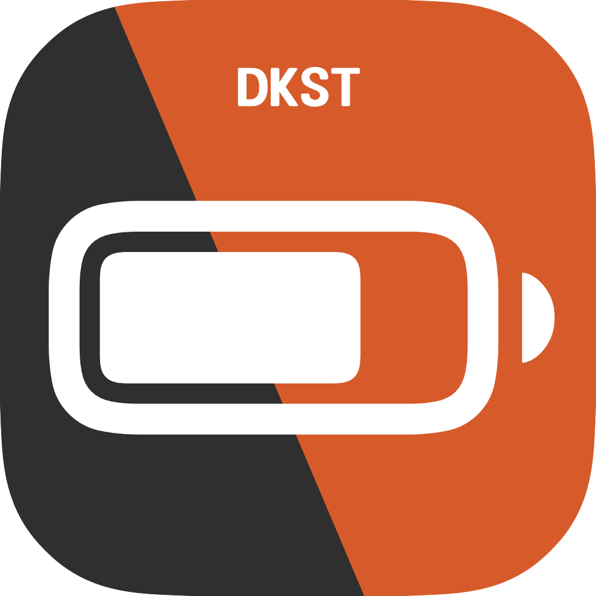
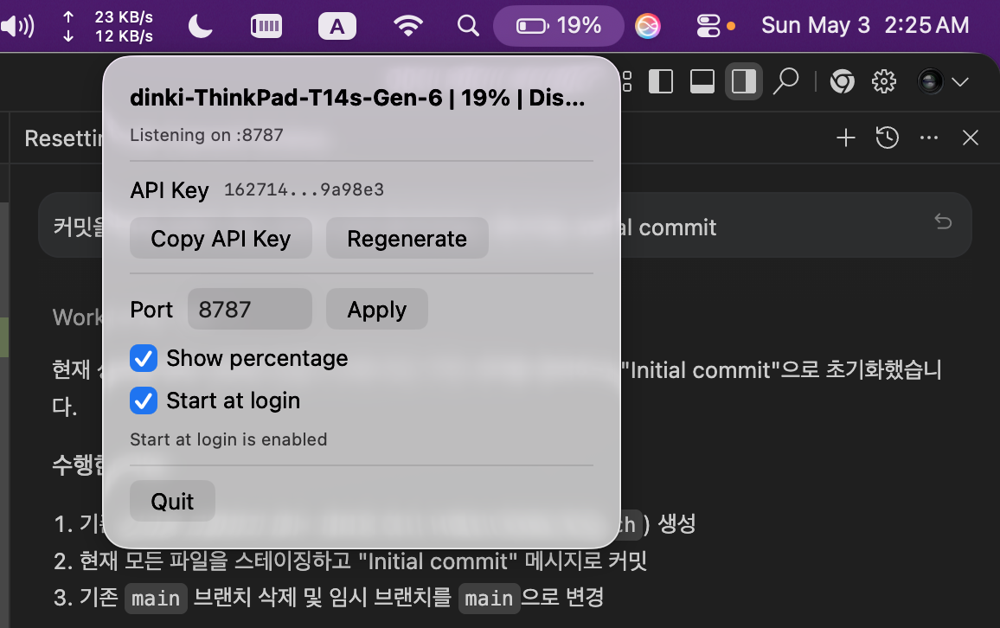

# DKST Linux Battery


<div align="center">

  <br><br>
</div>


Linux sends its battery status to a macOS menu bar app. macOS listens for HTTP POST requests and shows the latest received Linux battery percentage in the menu bar.

Linux 는 배터리 상태를 macOS 메뉴 바 앱으로 전송합니다. macOS 는 HTTP POST 요청을 수신하고, 메뉴 바에서 Linux 배터리 퍼센트를 표시합니다.

<div align="center">

  <br>
</div>

## macOS receiver (리눅스 배터리 정보 수신)

Build and run:

```sh
cd macos
swift run
```

Build a dockless app bundle:

```sh
./build-macos.sh
open "build/DKST Linux Battery.app"
```

The bundle identifier is `com.dinkisstyle.linuxbattery`. The app is configured as an agent app, so it appears only in the menu bar and not in the Dock.

The menu includes `Start at login`. This uses macOS Login Items and works from the bundled app build. If macOS shows an approval state, approve `Linux Battery` in System Settings > General > Login Items.

The receiver listens on port `8787` by default and accepts:


패키지 식별자는 `com.dinkisstyle.linuxbattery` 입니다. 이 앱은 에이전트 앱으로 설정되어 있어 독(Dock)에는 표시되지 않고 메뉴 바에만 표시됩니다.

메뉴에는 '로그인 시 시작' 항목이 포함되어 있습니다. 이는 macOS 로그인 항목을 사용하여 번들 앱 빌드에서 작동합니다. macOS 에서 승인이 필요하다면 시스템 설정 > 일반 > 로그인 항목에서 `DKST Linux Battery` 를 승인하세요.

수신자는 기본으로 포트 `8787` 을 수신하며 다음을 허용합니다:


```http
POST /battery
Content-Type: application/json
Authorization: Bearer <api-key>
```

```json
{
  "host": "linux-laptop",
  "percent": 78,
  "status": "Discharging",
  "is_charging": false,
  "timestamp": 1710000000
}
```

Quick local test:

```sh
curl -i -X POST http://127.0.0.1:8787/battery \
  -H 'Content-Type: application/json' \
  -H 'Authorization: Bearer <api-key-from-menu>' \
  -d '{"host":"linux-test","percent":78,"status":"Discharging","is_charging":false,"timestamp":1710000000}'
```

Use the macOS menu bar app's `Copy API Key` item to copy the key. `Regenerate` creates a new key and immediately invalidates the old one.

macOS 메뉴 바 앱의 `Copy API Key` 항목을 사용하여 키를 복사합니다. `Regenerate`은 새 키를 생성하고 즉시 기존 키를 무효화합니다.

## Linux sender (리눅스 배터리 정보 송신)

Build:

```sh
./build-linux.sh
```

Run the simple Linux GUI:

```sh
python3 build/DKST-Linux-Battery-GUI.py
```

The GUI stores its settings in `~/.config/dkst-linux-battery/config.json`. Pressing `Run` saves the values, starts `DKST Linux Battery Agent` in the background, writes its PID to `~/.config/dkst-linux-battery/agent.pid`, writes logs to `~/.config/dkst-linux-battery/agent.log`, and closes the window. Reopening the GUI shows the window again and displays the running PID. Pressing `Quit` stops the background process and closes the GUI.

GUI 는 `~/.config/dkst-linux-battery/config.json` 에 설정을 저장합니다. `Run` 을 누르면 값이 저장되고 백그라운드에서 `DKST Linux Battery Agent` 가 시작되며, 그 PID 를 `~/.config/dkst-linux-battery/agent.pid` 에 기록하고 로그를 `~/.config/dkst-linux-battery/agent.log` 에 기록한 후 창을 닫습니다. GUI 를 다시 열면 창이 다시 표시되고 실행 중인 PID 를 보여줍니다. `Quit` 를 누르면 백그라운드 프로세스가 중지되고 GUI 가 닫힙니다.


Run continuously:

```sh
./build/DKST\ Linux\ Battery\ Agent -server http://macbook.local:8787/battery -api-key <api-key-from-menu> -interval 5s
```

Install as a user service:

```sh
sudo install -m 0755 "build/DKST Linux Battery Agent" "/usr/local/bin/DKST Linux Battery Agent"
mkdir -p ~/.config/systemd/user
cp linux-battery-agent.service ~/.config/systemd/user/
systemctl --user daemon-reload
systemctl --user enable --now linux-battery-agent.service
```

Edit `LINUX_BATTERY_SERVER` and `LINUX_BATTERY_API_KEY` in the service file before enabling it.

Edit `LINUX_BATTERY_SERVER` 와 `LINUX_BATTERY_API_KEY` 를 서비스 파일에서 편집한 후 활성화하세요.


<div align="center">
<a href="https://github.com/DINKIssTyle/DINKIssTyle-Markdown-Browser" target="_blank"></a>
</div>
